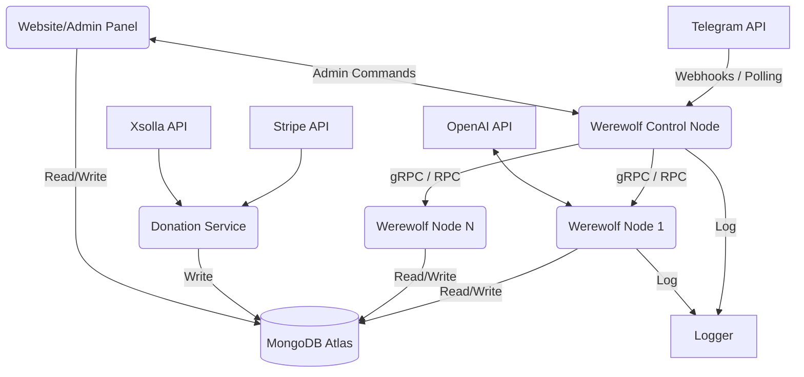

# Service Dependency Graph

## Key Dependencies
1. **Telegram API:** Entry point for all user interaction.
2. **MongoDB Atlas:** Central state storage for stats, bans, and user profiles. Game state during active play is kept in Node memory.
3. **OpenAI:** Used within the game loop (Node) for dummy defense text.
4. **Payment Providers:** Triggers webhooks in the Donation service.
